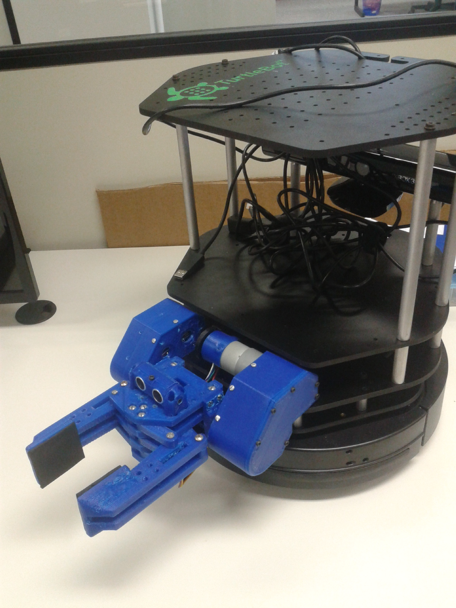

# ZZ-Gripper v1.0

####Introdução: ####
Feita no laboratório de sistemas autônomos, [LSA](https://www.inf.pucrs.br/felipe.meneguzzi/lsa/), da FACIN na PUCRS.
Esta gripper foi desenvolvida no laboratório visando aplicações _pick-and-place_ em conjunto com o robo Turtlebot.

####Especificações:####
+ Microcontrolador: Arduino nano
+ Driver: TB6612-Dual Motor Driver
+ Atuadores: 2 Graus de liberdade
+ Sensores: Sensor de força, sensor ultrasonico, sensor de corrente, chave fim de curso.
+ Peso (partes plasticas): ?
+ Peso total: ?
+ Custo total: ?
+ Tempo para construção: ?
+ Dimenções: ?
+ Força aplicada a objeto: ~500g
+ Peso máximo de sustentação: ~700g

####TO-DO_List:####
- [ ] Manual ZZ-Gripper v1.0
- [ ] Teste funcional por ssh (sem alimentação externa)
- [x] Projeto Solidworks
- [x] Driver exemplo ROS
- [x] Esquema elétrico da placa de controle

